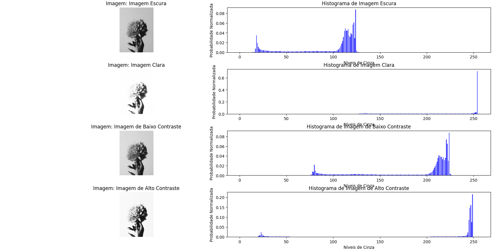

# Histogram
Este programa em Python utiliza bibliotecas como OpenCV, NumPy e Matplotlib para analisar e visualizar histogramas de imagens em níveis de cinza. Ele foi projetado para calcular os histogramas normalizados de quatro versões de uma imagem (escura, clara, baixo contraste e alto contraste), todas armazenadas em uma pasta chamada images.

## **Pré-requisitos**

1. **Python 3.7 ou superior**
2. As seguintes bibliotecas devem estar instaladas:
   - `opencv-python`
   - `numpy`
   - `matplotlib`

## **Instalação**

1. Clone o repositório do GitHub:
   ```bash
   git clone https://github.com/alexsami-lopes/Histogram.git
   cd Histogram-main

## **Instale as dependências do projeto usando pip**
    pip install opencv-python numpy matplotlib
      

   
## **Imagens Necessárias**

1. Certifique-se de que as imagens necessárias estejam na pasta images::
   - `escura.png`
   - `clara.png`
   - `baixo_contraste.png`
   - `alto_contraste.png`


## **Como rodar o programa**

1. Garanta que o arquivo Python principal (`histogramas.py`) e a pasta `images` estejam no mesmo diretório.
2. Execute o programa:
   ```bash
   python histogramas.py

## **Funcionamento do código**

- O programa lê as imagens em tons de cinza da pasta `images`.
- Para cada imagem, ele:
  1. Calcula a frequência de cada nível de cinza (0 a 255) usando a função `np.histogram`.
  2. Normaliza o histograma dividindo cada frequência pelo número total de pixels da imagem.
  3. Exibe a imagem original e o histograma lado a lado.


## **Exemplo de saída**

Abaixo está uma ilustração (Figura_1.png) mostrando como o programa exibe os resultados:



